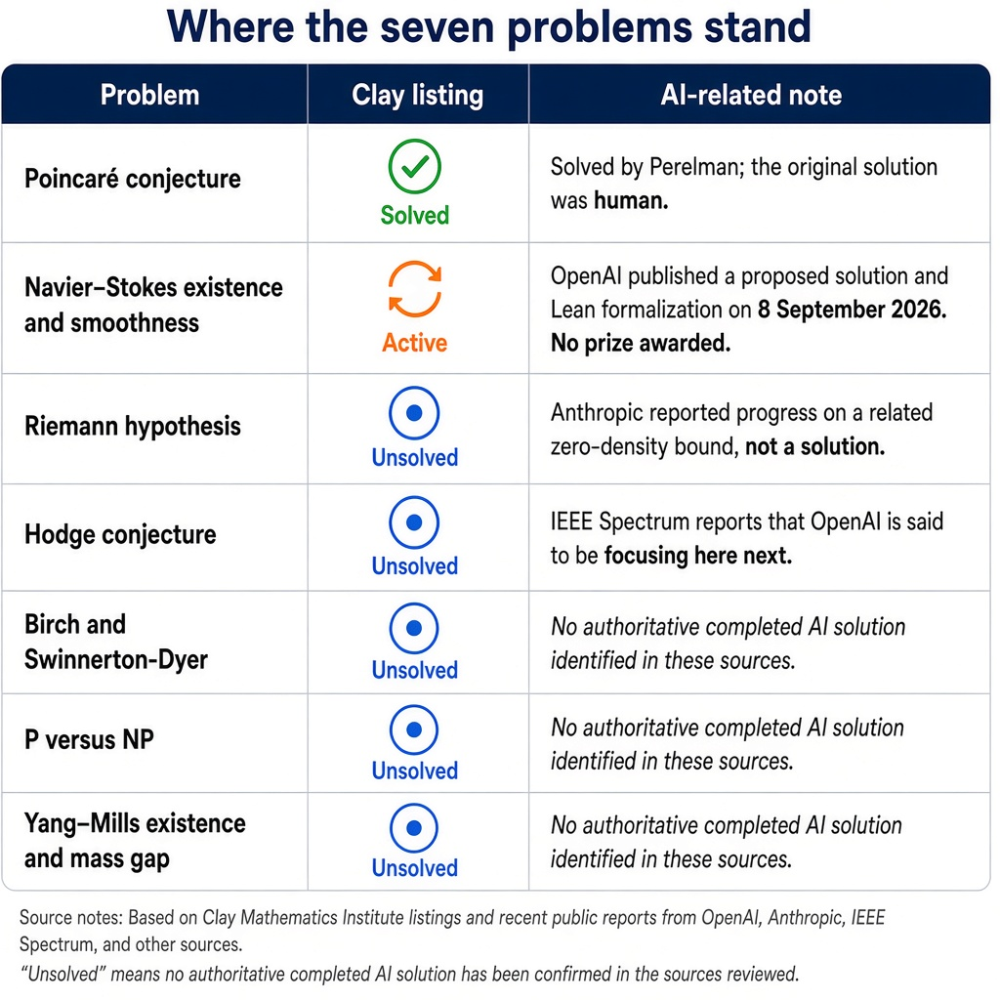

Level 4Painfully challenging

<section class="sw-lede" aria-labelledby="about-title">
  

    <h2 id="about-title">Zeros, the critical line, and time-to-solve</h2>
    
This repository holds the Riemann zeta notes and the P versus NP slides that were written with them. For real part greater than 1, the zeta function is the series of reciprocal powers, and Euler’s product writes that series over the primes. The notes follow the function into the critical strip and state the Riemann hypothesis: every non-trivial zero has real part one half. The <a href="riemann-zeta-notes.html">HTML walkthrough</a> keeps the slides, the functional equation, and the Python appendices for the phase plot and the surface plot.

    
The explicit formula is why the zeros sit next to the primes. The Chebyshev function ψ(x) has a main term x, a sum over the non-trivial zeros, and lower-order corrections. The prime-counting function picks up the same oscillation through a sum of Li(xρ). Phase plots, contour plots, and a surface of the modulus show those zeros as singularities and as crossings of the real and imaginary zero curves. The plots record the zeros that were calculated. The hypothesis remains open.

    
The same folder asks the question in the <a href="https://github.com/sdcastillo/Riemann/blob/main/README.md">README</a>: does every efficiently verifiable problem also have an efficiently solvable answer? The P versus NP Beamer sources and the deck <a href="P_vs_NP_Presentation_by_Sam.pdf">P vs NP</a> treat that as time-to-solve. Constant, logarithmic, linear, quadratic, and exponential growth are written out with everyday comparisons, from a dictionary lookup to guessing every character of a password. A recording of the presentation is on <a href="https://youtu.be/UgRNtOb6joY?si=YEPT820qiTTi9QgP">YouTube</a>. More writing is at <a href="https://www.predictiveinsightsai.com">predictiveinsightsai.com</a>.

    
<strong>Difficulty: painfully challenging.</strong> On the SamWiki ladder this is Level 4, painfully challenging, for analytic number theory. The Riemann hypothesis is open, and so is P versus NP. What is here is the presentation layer: definitions, the critical line, an error term the hypothesis would give the prime-number theorem, NP-completeness, and an AI-assisted frame for exploring both. A reader can start from the Basel problem and the verifier definition. Closing either question is the part that still needs a proof.

  

  <aside class="sw-find" aria-labelledby="facts-title">
    <h2 id="facts-title">On this page</h2>
    <ul>
      <li><strong>What it is</strong> Zeta-function notes and P versus NP slides, in PDF, PowerPoint, Beamer, and HTML.</li>
      <li><strong>Who it is for</strong> Analytic number theory, and readers following verification versus solving.</li>
      <li><strong>Difficulty: painfully challenging</strong> Level 4 on the SamWiki ladder. Research math. Both headline questions are open.</li>
      <li><strong>The bridge</strong> Non-trivial zeros enter the explicit formula for the primes. Plots show the zeros that were computed.</li>
      <li><strong>The outline</strong> Motivation, NP-completeness, the critical line, Big-O growth, and the about note from the README.</li>
    </ul>
  </aside>
</section>

# AI and the Millennium Prize Problems: a claim, not a prize

*Mathematics and artificial intelligence · 6 October 2026*

OpenAI has published a proposed solution to the Navier–Stokes existence and smoothness problem, with a Lean formalization. The Clay Mathematics Institute still lists the problem as active, and no Millennium Prize has been awarded.

Mathematics has become a preferred proving ground for frontier models. A derivation can be checked step by step, and a formal proof can be verified by a machine even when no person has read every line. Over the past year that property has pulled laboratories from contest problems toward questions that have stood for decades.

The sharpest example is the set of seven Millennium Prize Problems, announced by the Clay Mathematics Institute in Paris on 24 May 2000. Each carries a prize of $1 million. Only one, the Poincaré conjecture, has been solved by a human mathematician: Grigori Perelman. As of 11 September 2026, Clay still listed five problems as unsolved and labeled Navier–Stokes “Active.”

## What OpenAI announced

On 8 September 2026, OpenAI said an internal system had produced an analytical proof that a smooth, forced three-dimensional Navier–Stokes flow can develop a finite-time singularity while retaining finite energy. The claim is a breakdown result: an initially smooth fluid whose velocity becomes unbounded in finite time. The construction uses a nonzero smooth external force, and the company said the argument corresponds to breakdown alternatives (C) and (D) in the official formulation.

Reporting from *Quanta Magazine* and *THE Journal* describes the scale of the run. About 10,000 autonomous agents, on a model not available to the public, reached a proposed proof after roughly 88 hours. A second model then spent about 17 hours formalizing and checking it. An arXiv commentary, “Overture,” puts the accompanying text at 166 pages and the Lean certificate at about 616,000 lines, and notes that, at the time of writing, no person was known to have read the proof in full. The same note estimates 2.7 million messages and 130 billion output tokens, which one observer put at roughly $22 million at retail prices. The effort is said to have begun on 1 September after a rumor, later described as false, that two Millennium problems had already been resolved elsewhere.

The announcement came about 12 hours after Tristan Buckmaster of New York University and Levent Alpöge of Anthropic reported related results. By Buckmaster’s account, they had a variant with forcing smooth in space and time on 15 August, Lean-verified on 22 August. Both efforts drew on a strategy developed by Diego Córdoba of the Institute for Mathematical Sciences in Madrid and Luis Martínez-Zoroa of CUNEF University.

> **Status, not headline.** Wolfram MathWorld records that on 11 September 2026 Clay described the problem as “apparently” settled and said evaluation and credit would follow its prize rules. The announcement did not award a prize. Clay’s rules require publication in a qualifying outlet, general acceptance in the mathematical community, and at least two years of publication before the institute will consider a prize. A survey by Kingy.ai reaches the same practical verdict: proposed AI solution, not Clay-certified.

## Where the seven problems stand

| Problem | Clay listing | AI-related note |
| --- | --- | --- |
| Poincaré conjecture | Solved | Solved by Perelman; the original solution was human. |
| Navier–Stokes existence and smoothness | Active | OpenAI published a proposed solution and Lean formalization on 8 September 2026. No prize awarded. |
| Riemann hypothesis | Unsolved | Anthropic reported progress on a related zero-density bound, not a solution. |
| Hodge conjecture | Unsolved | IEEE Spectrum reports that OpenAI is said to be focusing here next. |
| Birch and Swinnerton-Dyer | Unsolved | No authoritative completed AI solution identified in these sources. |
| P versus NP | Unsolved | No authoritative completed AI solution identified in these sources. |
| Yang–Mills existence and mass gap | Unsolved | No authoritative completed AI solution identified in these sources. |

## Riemann, Fermat, and the next targets

The laboratories have not waited on Navier–Stokes alone. *IEEE Spectrum* reports that, in short order, systems moved from ordinary research problems to a run of questions associated with Paul Erdős, a verification of Fermat’s Last Theorem, and the Navier–Stokes claim. Anthropic says a multi-agent system produced what it calls the first complete computer-checked formalization of Fermat’s Last Theorem in less than two weeks: about 13 million lines of Lean and 29,500 intermediate theorems. Formalizing a known theorem is not the same as discovering it.

On the Riemann hypothesis, Anthropic used an unreleased version of Claude and did not claim a solution. According to *THE Journal*, the model improved a longstanding lower bound related to the zeros of the zeta function from 41.6 percent to 67.2 percent. Two Anthropic mathematicians examined the work, outside experts reviewed the paper on short notice, and Claude produced a formally verifiable version of that related result. Spectrum reports that OpenAI is separately said to be concentrating on the Hodge conjecture, and that rumors continue about which remaining prize problem will be attempted next. The same piece treats the prize list as a capability test with a public audience: a famous unsolved problem is legible to users and investors in a way that an incremental lemma is not.

## A wider shift in mathematical work

The Millennium claims sit on a year of smaller but documented gains. Epoch AI’s FrontierMath open-problem list marked a Hadamard matrix of order 668 as solved by AI on 12 August 2026, on a report from an Anthropic researcher crediting three humans and Claude; the designation was provisional. On 16 September, Epoch changed its policy so that some human-directed, AI-dependent solutions can be marked as AI solutions rather than purely human ones. The inverse Galois problem for the Mathieu group \(M_{23}\) was marked solved by humans, via Huang and coauthors.

Elsewhere, the record is a mix of benchmarks, formalization, and occasional new bounds. Seed-Prover is reported at 99.6 percent on a 244-problem set, with one item left open, and at five of six problems on the 2025 International Mathematical Olympiad, a level also reached by Gemini Deep Think and an experimental GPT-5 system. HorizonMath, a benchmark of more than 100 mostly unsolved applied and computational problems, records two cases in which GPT 5.4 Pro proposed improvements on published bounds, pending expert review. FunSearch, AlphaEvolve, Aletheia, and Aristotle have been credited with cap-set bounds, matrix-multiplication and kissing-number improvements, Erdős problems, and formal proofs. Donald Knuth has described using Claude Opus 4.6 on a Cayley-digraph decomposition, then proving the resulting construction himself.

A survey of this literature draws a useful distinction. Formalized proofs and literature reviews account for the largest volume. Results with no prior known argument, produced primarily by a model, are fewer. That distinction matters for Navier–Stokes. A Lean certificate can show that a stated argument checks. It cannot, by itself, show that the statement is the one Clay posed, that the community accepts the reduction, or that credit and priority are settled.

## What remains unresolved

If the Navier–Stokes argument survives specialist scrutiny, it would be the largest mathematical result yet attributed primarily to an automated system. The sources assembled here do not establish that survival. Clay has not closed the problem, has not awarded $1 million, and has pointed to its ordinary rules: qualifying publication, community acceptance, and a two-year wait. Until those conditions are met, the accurate description is the narrower one. An AI laboratory has proposed a solution. The prize problem is still active.

## Sources

1. Dina Genkina, “AI in Mathematics Challenges Academic Norms,” *IEEE Spectrum*, 5 October 2026. [spectrum.ieee.org/millennium-prize-ai](https://spectrum.ieee.org/millennium-prize-ai)
2. “Millennium Prize Problems and AI,” Kingy.ai, updated 22 September 2026. [kingy.ai/millennium-prize-problems-ai](https://kingy.ai/millennium-prize-problems-ai/)
3. “Millennium Prize Problems,” Wolfram MathWorld, updated 5 October 2026. [mathworld.wolfram.com/MillenniumPrizeProblems.html](https://mathworld.wolfram.com/MillenniumPrizeProblems.html)
4. “AI Models Generate Advances in Mathematical Research,” *THE Journal*, 10 September 2026. [thejournal.com](https://thejournal.com/articles/2026/09/10/ai-models-generate-advances-in-mathematical-research.aspx)
5. “Overture,” arXiv:2609.28591, updated 3 October 2026. [arxiv.org/html/2609.28591v3](https://arxiv.org/html/2609.28591v3)
6. “AI Has Solved One of Math’s $1 Million Millennium Prize Problems,” *Quanta Magazine*, 8 September 2026. [quantamagazine.org](https://www.quantamagazine.org/ai-has-solved-one-of-maths-1-million-millennium-prize-problems-20260908/)
7. “Towards Autonomous Mathematics Research,” arXiv:2602.10177. [ar5iv.labs.arxiv.org/html/2602.10177](https://ar5iv.labs.arxiv.org/html/2602.10177)
8. “FrontierMath: Open Problems,” Epoch AI, updated 2 October 2026. [epoch.ai/frontiermath/open-problems](https://epoch.ai/frontiermath/open-problems)
9. “HorizonMath,” arXiv:2603.15617. [arxiv.org/html/2603.15617v1](https://arxiv.org/html/2603.15617v1)
10. “From Solvers to Research,” arXiv:2607.07779, updated 3 October 2026. [arxiv.org/html/2607.07779v1](https://arxiv.org/html/2607.07779v1)

## What you will learn

The README already lists the path through the talks:

- **Motivation and real-world impact.** Why P versus NP matters, and how time, memory, energy, and hardware bound what stays solvable.
- **Intuition and NP-completeness.** Verifying an answer and finding an answer are different jobs.
- **The Riemann hypothesis.** The zeros of the zeta function shape the oscillation in the primes. The claim is that every non-trivial zero lies on the critical line.

## Feasibility and runtime growth

The scale notes use Big O, as written in the README:

- **O(1), constant time.** Looking up the first item in a list.
- **O(log n), logarithmic.** Searching for a word in a physical dictionary.
- **O(n), linear time.** Reading through every page of a book one by one.
- **O(n²), quadratic time.** Checking a room of people for shared birthdays by making everyone introduce themselves to everyone else.
- **O(2ⁿ), exponential time.** Trying to crack a password by guessing every possible combination of characters.

## Files in this repository

- [HTML walkthrough](riemann-zeta-notes.html) of the zeta slides, including the phase-plot and surface-plot appendices.
- [The Riemann Zeta Function, by Sam Castillo (PDF)](The_Riemann_Zeta_Function_by_Sam_Castillo.pdf) and the [PowerPoint](The_Riemann_Zeta_Function_by_Sam_Castillo.ppt).
- [Zeros, the critical line, and computational exploration (PDF)](The_Riemann_Zeta_Fuction__Zeros__the_Critical_Line__and_Computational_Exploration.pdf), a [second PDF export](The_Riemann_Zeta_Fuction__Zeros__the_Critical_Line__and_Computational_Exploration-1.pdf), and the [zip](The_Riemann_Zeta_Fuction__Zeros__the_Critical_Line__and_Computational_Exploration.zip).
- [The sum of the reciprocals of the squares (PDF)](The_Sum_of_the_Reciprocals_of_the_Squares__Zeros_of_Reimman_.pdf), the [PowerPoint](The_Sum_of_the_Reciprocals_of_the_Squares__Zeros_of_Reimman_.pptx), and the [zip](The_Sum_of_the_Reciprocals_of_the_Squares__Zeros_of_Reimman_.zip).
- Beamer source: [riemann_zeta_beamer.tex](riemann_zeta_beamer.tex), [riemann_beamer_visual_refresh.tex](riemann_beamer_visual_refresh.tex), [p_vs_np_beamer.tex](p_vs_np_beamer.tex), and [p_vs_np_beamer_styled.tex](p_vs_np_beamer_styled.tex).
- [P vs NP (PDF)](P_vs_NP_Presentation_by_Sam.pdf) and the [PowerPoint](P_vs_NP_Presentation_by_Sam.ppt).
- [Page images zip](ilovepdf_pages-to-jpg.zip).

## About

Drawing on a B.S. in Mathematics (with honors) from UMass Amherst, a background in actuarial sciences (probability, statistics, financial mathematics, and time series analysis), and over six years of building computing systems, the presentations connect the theory to large-scale implementation.

## Topics

P versus NP, the Riemann hypothesis, quantum statistics, complexity theory, mathematics, computer science, Big O, number theory, NP-complete problems, algorithm design, computational complexity, actuarial science, data science, mathematical physics, the Millennium Prize problems, and quantum computing.

<section class="sw-contribute" aria-labelledby="contribute-title">
  <h2 id="contribute-title">Contribute</h2>
  
Fork <a href="https://github.com/sdcastillo/Riemann">sdcastillo/Riemann</a>, make the improvement, and send it back. A clearer step in the notes, a fix in the Beamer source, or a correction to a formula belongs in a pull request.

  

    <a class="sw-btn sw-btn-pr" href="https://github.com/sdcastillo/Riemann/compare" target="_blank" rel="noopener noreferrer">Contribute / Open a PR</a>
  

</section>
